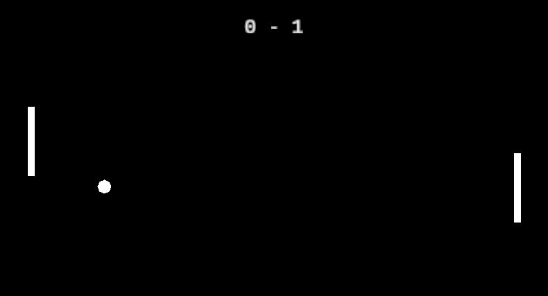

# Pong in Rust using GGEZ
This is a simple pong clone game built with Rust using the [GGEZ library](https://github.com/ggez/ggez). GGEZ is a 2D game engine for Rust, inspired by the LÖVE framework. You can just download this repository and run `pong_clone.exe` if you are on windows to play the game.



## 🌟 Features
- AI-controlled paddle for the right player.
- Collision detection for ball and paddles.
- Score tracking.
- Guaranteed loss for the left player.

## 💻 Installation
If you are not on Windows or you want to modify and recompile the game, you can follow these steps:
1. Ensure you have Rust installed.
2. Clone the repository:
   ```
   git clone https://github.com/QuentinWach/pong-in-rust.git
   ```
3. Navigate to the project directory:
   ```
   cd pong-clone
   ```
4. Build the project:
   ```
   cargo build
   ```
5. Run the game:
   ```
   cargo run
   ```